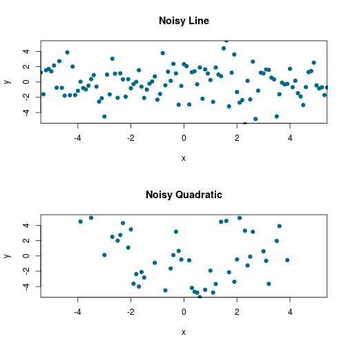

Polynomial Explorer
========================================================
author: A Tool for Learning Polynomial Properties 
date: Clyde Tressler

Why Explore Polynomials?
========================================================
type: exclaim

Polynomials are useful functions for linear modeling and
- are suitable for real number valued outcomes with numerical predictors
- arise naturally in many physical systems

<h2>However: high degree polynomials can **[overfit](https://en.wikipedia.org/wiki/Overfitting)** noisy data.</h2>

******

 

Spotting Trends
========================================================
type: exclaim

- It's easy to distinguish odd degree functions from even degree functions with no noise present
- <b>But</b> noise can quickly overwhelm even simple linear and quadratic relationships

***

 

Polynomial Explorer
========================================================
type: exclaim
class: explorer
left: 40%

Randomly generates polynomials of the form: 
$$y = ax^5 + bx^4 + cx^3 + dx^2 + x + constant +\epsilon$$

- visualizes polynomials with normally-distributed noise
- familiarizes the user with fitting polynomial curves using R's lm() function.
- shows a key measure of fit: [Residual Sum of Squares](https://en.wikipedia.org/wiki/Residual_sum_of_squares)

***

Future Development
========================================================
type: exclaim
class: future
- inclusion of log and trigonometric functions
- 'user-built' polynomials add control to visualization
- transtioning to **Linear Model Explorer**

***

 

Visit soon at <a href = "https://amalgamatedclyde.shinyapps.io/polynomial_explorer", target="_blank">Polynomial Trend Spotter</a> Source code at:<a href="https://github.com/amalgamatedclyde/ddp_shiny"> https://github.com/amalgamatedclyde/ddp_shiny</a>

